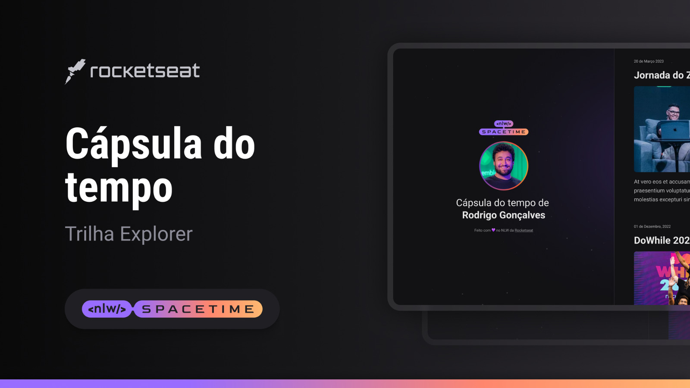

  

## 💻 Projeto

Esse é um projeto web Responsivo de uma cápsula do tempo para exibir memórias em uma linha do tempo.

## 🚀 Tecnologias

Esse projeto foi desenvolvido durante o NLW: SpaceTime da Rocketseat com as seguintes tecnologias:

-HTML

-CSS

-GIT

-GITHUB

-FIGMA

## 🏷️ Layout

Você pode visualizar o layout do projeto através [desse link](https://www.figma.com/community/file/1240071097028170811/C%C3%A1psula-do-tempo-%E2%80%A2-Trilha-Explorer).

É necessário ter conta no [Figma](https://www.figma.com/).
